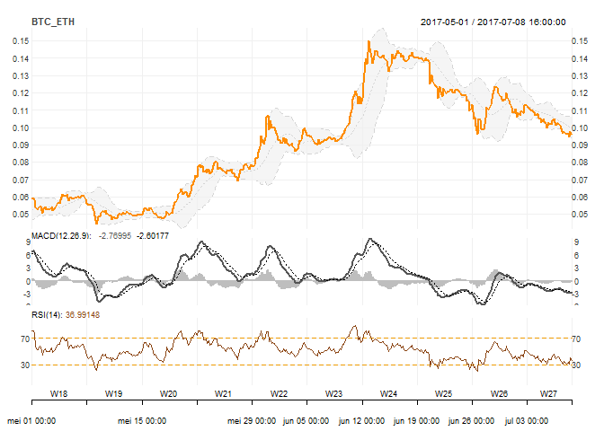

PoloniexR
================

[](https://travis-ci.org/VermeirJellen/PoloniexR)

This package provides a user-friendly R interface to the Poloniex (Cryptocurrency Trading) REST API.

### Installation

The package has been submitted to CRAN and can be installed in the usual manner:

``` r
install.packages("PoloniexR")
```

Note - version 0.0.1 contains a small bug related to the ```returnDepositWithdrawals``` trading command. The associated value of this field should be ```returnDepositsWithdrawals``` (instead of the default ```returnDepositWithdrawals``` value). Starting from version 0.0.2 both the command name field and corresponding value have been changed to ```returnDepositsWithdrawals``` in order to correctly represent the Poloniex command string and value. At the time of writing, the latest version has not yet been uploaded to CRAN (view issues). If you are using version 0.0.1 you can manually modify the command field to the correct value, as explained in the tutorial below.

Alternatively, you can download the latest version from Github by using the `devtools` utility:

``` r
# install.packages("devtools") # if devtools currently not installed
devtools::install_github("VermeirJellen/PoloniexR")
```

Following the installation, the library can be loaded: `library(PoloniexR)`.

PoloniexPublicAPI / PoloniexTradingAPI
--------------------------------------

The package exposes 2 S4 classes to the users:

-   `PoloniexPublicAPI`: Consists of wrapper methods on top of the Poloniex Public REST API.
-   `PoloniexTradingAPI`: Consists of wrapper methods on top of the Poloniex Trading REST API.

Methods provided by the `PoloniexPublicAPI`:

-   `ReturnTicker`
-   `Return24hVolume`
-   `ReturnOrderBook`
-   `ReturnTradeHistory`
-   `ReturnChartData`
-   `ReturnCurrencies`
-   `ReturnLoanOrders`

Methods provided by the `PoloniexTradingAPI`:

-   **ProcessTradingRequest()**: Allows the users to call any of the trading API methods that are provided by Poloniex.
-   `ReturnBalances`
-   `ReturnCompleteBalances`

Use`?<function.name>` to read full I/O specs and function documentation. cfr `?ReturnTicker`.

**Examples are provided in the sections below**

### PUBLIC API - EXAMPLES

#### ReturnTicker

Run `?ReturnTicker` for additional function documentation.

``` r
library(PoloniexR)
poloniex.public <- PoloniexPublicAPI()
ticker.info     <- ReturnTicker(poloniex.public)
head(ticker.info)
```

    ##          id       last  lowestAsk highestBid percentChange    baseVolume
    ## BTC_BCN   7 0.00000045 0.00000045 0.00000044    0.04651162  140.34075817
    ## BTC_BELA  8 0.00003500 0.00003493 0.00003489   -0.00085640   14.99802048
    ## BTC_BLK  10 0.00005187 0.00005206 0.00005187    0.01052016   37.94874739
    ## BTC_BTCD 12 0.02531388 0.02536933 0.02531388    0.03609528  100.84732395
    ## BTC_BTM  13 0.00015154 0.00015865 0.00015235    0.03510928   14.71463897
    ## BTC_BTS  14 0.00002839 0.00002839 0.00002819    0.04876246 1622.58729620
    ##                 quoteVolume isFrozen   high24hr    low24hr
    ## BTC_BCN  325325457.89093947        0 0.00000046 0.00000040
    ## BTC_BELA    434565.68383812        0 0.00003594 0.00003295
    ## BTC_BLK     737890.01313361        0 0.00005745 0.00004703
    ## BTC_BTCD      4313.59357954        0 0.02553146 0.02082233
    ## BTC_BTM      96666.03400292        0 0.00016196 0.00014301
    ## BTC_BTS   59739194.52850370        0 0.00002967 0.00002413

#### Return24hVolume

Run `?Return24hVolume` for additional function documentation.

``` r
poloniex.public <- PoloniexPublicAPI()
volume.info <- Return24hVolume(poloniex.public)
head(volume.info$volume.pairs)
```

    ##               pair1        pair2
    ## BTC_BCN   140.34076 3.253255e+08
    ## BTC_BELA   14.99802 4.345657e+05
    ## BTC_BLK    37.94875 7.378900e+05
    ## BTC_BTCD  100.84732 4.313594e+03
    ## BTC_BTM    14.71464 9.666603e+04
    ## BTC_BTS  1622.58730 5.973919e+07

``` r
volume.info$volume.totals
```

    ##                   BTC            ETH               USDT           XMR
    ## volume 54914.00783741 13426.28979341 161543405.47171052 1476.97493209
    ##              XUSD
    ## volume 0.00000000

#### ReturnOrderBook

Run `?ReturnOrderBook` for additional function documentation.

``` r
pair       <- "BTC_NXT"
depth      <- 10
order.book <- ReturnOrderBook(poloniex.public,
                              pair  = pair,
                              depth = depth)
head(order.book$bid)
```

    ##          bid         amount
    ## 1 0.00002081            755
    ## 2 0.00002080   8391.5691609
    ## 3 0.00002079 23929.69296271
    ## 4 0.00002071  8384.47593762
    ## 5 0.00002070 13025.43023026
    ## 6 0.00002069    48.33972383

``` r
head(order.book$ask)
```

    ##          ask        amount
    ## 1 0.00002083           105
    ## 2 0.00002086   48.17048637
    ## 3 0.00002088   48.12226767
    ## 4 0.00002089 2365.37057941
    ## 5 0.00002090           200
    ## 6 0.00002091    48.0741454

``` r
order.book$frozen
```

    ## [1] FALSE

``` r
order.book$seq
```

    ## [1] 45701656

``` r
pair       <- "all"
depth      <- 10
order.book <- ReturnOrderBook(poloniex.public,
                              pair  = pair,
                              depth = depth)

order.book$BTC_ETH$bid
```

    ##           bid      amount
    ## 1  0.07060716    0.099737
    ## 2  0.07060705  6.48402184
    ## 3  0.07060352        8.87
    ## 4  0.07058794 12.01611542
    ## 5  0.07058781  4.76768449
    ## 6  0.07057696           8
    ## 7  0.07055265        2.59
    ## 8  0.07054405           2
    ## 9  0.07052954        6.91
    ## 10 0.07050518  0.00713392

``` r
order.book$BTC_ETH$ask
```

    ##           ask      amount
    ## 1  0.07070000  0.31644926
    ## 2  0.07073720  0.00370166
    ## 3  0.07075266           8
    ## 4  0.07075539  0.01099231
    ## 5  0.07076538           7
    ## 6  0.07076539 39.99975913
    ## 7  0.07077384  0.17206337
    ## 8  0.07077550         7.6
    ## 9  0.07078920  0.03384221
    ## 10 0.07080000        0.03

``` r
order.book$BTC_ETH$frozen
```

    ## [1] FALSE

``` r
order.book$BTC_ETH$seq
```

    ## [1] 400870315

#### ReturnTradeHistory

Run `?ReturnTradeHistory` for additional function documentation.

``` r
Sys.setenv(tz="UTC")
pair   <- "BTC_ETH"
from   <- as.POSIXct("2017-07-01 00:00:00 UTC")
to     <- as.POSIXct("2017-07-04 00:00:00 UTC")

trades.data <- ReturnTradeHistory(theObject = poloniex.public,
                                  pair      = pair,
                                  from      = from,
                                  to        = to)

tail(trades.data)
```

    ##                     globalTradeID tradeID    type  rate        
    ## 2017-07-03 23:59:41 "183463123"   "29391027" "buy" "0.10833668"
    ## 2017-07-03 23:59:44 "183463138"   "29391033" "buy" "0.10857999"
    ## 2017-07-03 23:59:46 "183463154"   "29391034" "buy" "0.10863293"
    ## 2017-07-03 23:59:55 "183463170"   "29391037" "buy" "0.10865144"
    ## 2017-07-03 23:59:55 "183463169"   "29391036" "buy" "0.10863293"
    ## 2017-07-03 23:59:55 "183463168"   "29391035" "buy" "0.10846100"
    ##                     amount        total       
    ## 2017-07-03 23:59:41 "0.99125595"  "0.10738937"
    ## 2017-07-03 23:59:44 "0.22670282"  "0.02461538"
    ## 2017-07-03 23:59:46 "14.87694700" "1.61612634"
    ## 2017-07-03 23:59:55 "4.59690907"  "0.49946079"
    ## 2017-07-03 23:59:55 "2.19075626"  "0.23798827"
    ## 2017-07-03 23:59:55 "0.92199039"  "0.09999999"

#### ReturnChartData

Run `?ReturnChartData` for additional function documentation.

``` r
Sys.setenv(tz="UTC")
pair    <- "BTC_ETH"
from    <- as.POSIXct("2015-01-01 00:00:00 UTC")
to      <- as.POSIXct("2018-04-09 00:00:00 UTC")
period  <- "4H"

chart.data <- ReturnChartData(theObject = poloniex.public,
                              pair      = pair,
                              from      = from,
                              to        = to,
                              period    = period)

tail(chart.data)
```

    ##                           high        low       open      close     volume
    ## 2017-09-04 20:00:00 0.07296796 0.07003290 0.07111984 0.07038424 2713.50931
    ## 2017-09-05 00:00:00 0.07100000 0.06819028 0.07050940 0.06871113 3944.10524
    ## 2017-09-05 04:00:00 0.07136983 0.06711210 0.06877522 0.07098000 3066.17088
    ## 2017-09-05 08:00:00 0.07134999 0.06945009 0.07093359 0.07032699 2022.45269
    ## 2017-09-05 12:00:00 0.07180097 0.07003209 0.07034546 0.07065581 2221.75735
    ## 2017-09-05 16:00:00 0.07076540 0.07035476 0.07072645 0.07064626   84.04729
    ##                     quotevolume weightedaverage
    ## 2017-09-04 20:00:00   37967.109      0.07147000
    ## 2017-09-05 00:00:00   56908.735      0.06930579
    ## 2017-09-05 04:00:00   43959.378      0.06975009
    ## 2017-09-05 08:00:00   28689.985      0.07049333
    ## 2017-09-05 12:00:00   31247.551      0.07110180
    ## 2017-09-05 16:00:00    1190.345      0.07060753

``` r
# install.packages("quantmod")
library(quantmod)
chart.plot <- chart_Series(chart.data[, "close"],
                           type   = "line",
                           name   = "BTC_ETH",
                           subset = "201705/201708")
chart.plot <- add_MACD()
chart.plot <- add_BBands()
chart.plot <- add_RSI()
chart.plot
```



#### ReturnCurrencies

Run `?ReturnCurrencies` for function additional function documentation.

``` r
currencies <- ReturnCurrencies(poloniex.public)
head(currencies)
```

    ##      id           name      txFee minConf disabled delisted frozen
    ## 1CR   1        1CRedit 0.01000000       3        0        1      0
    ## ABY   2        ArtByte 0.01000000       8        0        1      0
    ## AC    3       AsiaCoin 0.01000000      15        0        1      0
    ## ACH   4 Altcoin Herald 0.00000000       5        0        1      0
    ## ADN   5          Aiden 0.01000000      24        0        1      0
    ## AEON  6      AEON Coin 0.01000000      10        0        1      0

#### ReturnLoanOrders

Run `?ReturnLoanOrders` for additional function documentation.

``` r
currency        <- "BTC"
loan.orders     <- ReturnLoanOrders(poloniex.public,
                                    currency = currency)
head(loan.orders$offers)
```

    ##         rate     amount min.days max.days
    ## 1 0.00015000 0.52249675        2        2
    ## 2 0.00015500 1.44362802        2        2
    ## 3 0.00015520 0.01795757        2        2
    ## 4 0.00015525 0.01807411        2        2
    ## 5 0.00015625 0.37500000        2        2
    ## 6 0.00015637 0.05502303        2        2

``` r
head(loan.orders$demands)
```

    ##         rate     amount min.days max.days
    ## 1 0.00000300 0.02109824        2        2
    ## 2 0.00000100 2.10582878        2        2

#### GET / SET public API URL and command Strings.

Note: Changing these settings is only useful if Poloniex makes changes to the base URL and/or command strings in the future. If nothing changes, object construction can remain default.

``` r
library(PoloniexR)

poloniex.public <- PoloniexPublicAPI() # Default constructor
GetPoloniexPublicURL(poloniex.public)
```

    ## [1] "https://poloniex.com/public?"

``` r
poloniex.public <- PoloniexPublicAPI(base.url                     = "https://not_working/public?")
poloniex.public <- SetPoloniexPublicURL(poloniex.public, base.url = "https://poloniex.com/public?")
GetPoloniexPublicURL(poloniex.public)
```

    ## [1] "https://poloniex.com/public?"

``` r
GetPoloniexPublicCommands(poloniex.public)
```

    ## $returnTicker
    ## [1] "returnTicker"
    ## 
    ## $return24hVolume
    ## [1] "return24hVolume"
    ## 
    ## $returnOrderBook
    ## [1] "returnOrderBook"
    ## 
    ## $returnTradeHistory
    ## [1] "returnTradeHistory"
    ## 
    ## $returnChartData
    ## [1] "returnChartData"
    ## 
    ## $returnCurrencies
    ## [1] "returnCurrencies"
    ## 
    ## $returnLoanOrders
    ## [1] "returnLoanOrders"

``` r
commands.new <- list(returnTicker    = "returnTicker.new",
                     return24hVolume = "return24hVolume.new")

# missing commands are kept default
poloniex.public <- SetPoloniexPublicCommands(poloniex.public,
                                             commands = commands.new)
```

    ## Warning in SetPoloniexPublicCommands(poloniex.public, commands =
    ## commands.new): Not all commands were set in the API command list input
    ## arguments: Setting missing commands to their respective default values.

``` r
GetPoloniexPublicCommands(poloniex.public)
```

    ## $returnTicker
    ## [1] "returnTicker.new"
    ## 
    ## $return24hVolume
    ## [1] "return24hVolume.new"
    ## 
    ## $returnOrderBook
    ## [1] "returnOrderBook"
    ## 
    ## $returnTradeHistory
    ## [1] "returnTradeHistory"
    ## 
    ## $returnChartData
    ## [1] "returnChartData"
    ## 
    ## $returnCurrencies
    ## [1] "returnCurrencies"
    ## 
    ## $returnLoanOrders
    ## [1] "returnLoanOrders"

### TRADING API - EXAMPLES

Trading should be enabled in your Poloniex settings and you should have access to your account key / secret in order to construct the `PoloniexTradingAPI` object. Internally, all calls to the trading API are sent via HTTP POST. The POST data itself is signed with your key's secret according to the HMAC-SHA512 method.

#### ReturnBalances

Wrapper on top of `ProcessTradingRequest` to fetch account balance info. Run `?ReturnBalances` for additional info.

``` r
key    = your.key
secret = your.secret
poloniex.trading <- PoloniexTradingAPI(key    = key,
                                       secret = secret)
balances <- ReturnBalances(poloniex.trading)
head(balances)
```

#### ReturnCompleteBalances

Wrapper on top of `ProcessTradingRequests` to fetch complete (margin, lending, ..) account balance info. Run `?ReturnCompleteBalances` for additional info.

``` r
balances <- ReturnCompleteBalances(poloniex.trading)
head(balances)

balances <- ReturnCompleteBalances(poloniex.trading, all.balances=TRUE)
head(balances)
```

#### ProcessTradingRequest

This function allows the users to call any of the trading functions that are accessible through the Poloniex Trading API. The `ProcessTradingRequest` method takes a command string as input argument in combination with a list of additional input arguments that correspond to the particular command in question.

Some examples:

``` r
##########################
# returnDepositAddresses #
##########################
?ProcessTradingRequest
deposit.addresses <- ProcessTradingRequest(poloniex.trading,
                                           command = poloniex.trading@commands$returnDepositAddresses)

#########################
# generateNewAddress ####
#########################
new.address <- ProcessTradingRequest(poloniex.trading,
                                     command = poloniex.trading@commands$generateNewAddress,
                                     args    = list(currency = "BTC"))


##############################
# returnDepositsWithdrawals ##
##############################
account.activity <- ProcessTradingRequest(poloniex.trading,
                                          command = poloniex.trading@commands$returnDepositsWithdrawals,
                                          args = list(start = as.numeric(as.POSIXct("2017-01-01 00:00:00 UTC"))),
                                                      end   = as.numeric(as.POSIXct("2018-01-01 00:00:00 UTC")))

##############################
### returnOpenOrders #########
##############################
open.orders <- ProcessTradingRequest(poloniex.trading,
                                     command = poloniex.trading@commands$returnOpenOrders,
                                     args    = list(currencyPair = "BTC_ETH"))

open.orders.all <- ProcessTradingRequest(poloniex.trading,
                                         command = poloniex.trading@commands$returnOpenOrders,
                                         args    = list(currencyPair = "all"))


##############################
### Return Trade History #####
##############################
trade.history <-  ProcessTradingRequest(poloniex.trading,
                                        command = poloniex.trading@commands$returnTradeHistory,
                                        args = list(currencyPair = "BTC_ETH",
                                                    start        = as.numeric(as.POSIXct("2017-01-01 00:00:00 UTC"))),
                                                    end          = as.numeric(as.POSIXct("2018-01-01 00:00:00 UTC")))

# no range specified: limit to one day
trade.history.all <-  ProcessTradingRequest(poloniex.trading,
                                            command = poloniex.trading@commands$returnTradeHistory,
                                            args    = list(currencyPair = "all"))


##############################
### ReturnOrderTrades ########
##############################
order.trades <- ProcessTradingRequest(poloniex.trading,
                                      command = poloniex.trading@commands$returnOrderTrades,
                                      args    = list(orderNumber = 1))

##############################
######### Buy ################
##############################
buy.order <- ProcessTradingRequest(poloniex.trading,
                                   command = poloniex.trading@commands$buy,
                                   args    = list(currencyPair      = "BTC_ETH",
                                                  rate              = 0.01,
                                                  amount            = 1,
                                                  immediateOrCancel = 1)) # fillOrKill, postOnly

##############################
######### Sell ###############
##############################
sell.order <- ProcessTradingRequest(poloniex.trading,
                                    command = poloniex.trading@commands$sell,
                                    args    = list(currencyPair      = "BTC_ETH",
                                                   rate              = 0.01,
                                                   amount            = 1))


##############################
######### cancelOrder ########
##############################
cancel.order <- ProcessTradingRequest(poloniex.trading,
                                      command = poloniex.trading@commands$cancelOrder,
                                      args    = list(orderNumber = 1))

##############################
######### moveOrder ##########
##############################
move.order <- ProcessTradingRequest(poloniex.trading,
                                    command = poloniex.trading@commands$moveOrder,
                                    args    = list(orderNumber       = 1,
                                                   rate              = 0.1,
                                                   amount            = 1,
                                                   immediateOrCancel = 1)) # postOnly
```

Other Trade functionality (View Poloniex API documentation):

-   withdraw: `poloniex.trading@commands$withdraw`
-   returnFeeInfo: `poloniex.trading@commands$returnFeeInfo`
-   returnAvailableAccountBalances: `poloniex.trading@commands$returnAvailableAccountBalances`
-   returnTradeableBalances: `poloniex.trading@commands$returnTradeableBalances`
-   transferBalance: `poloniex.trading@commands$transferBalance`
-   returnMarginAccountSummary: `poloniex.trading@commands$returnMarginAccountSummary`
-   marginBuy: `poloniex.trading@commands$marginBuy`
-   marginSell: `poloniex.trading@commands$marginSell`
-   getmarginPosition: `poloniex.trading@getMarginPosition`
-   closeMarginPosition: `poloniex.trading@closeMarginPosition`
-   createLoanOffer: `poloniex.trading@commands$createLoanOffer`
-   cancelLoanOffer: `poloniex.trading@commands$cancelLoanOffer`
-   returnOpenLoanOffers: `poloniex.trading@commands$returnOpenLoanOffers`
-   returnActiveLoans: `poloniex.trading@commands$returnActiveLoans`
-   returnLendingHistory: `poloniex.trading@commands$returnLendingHistory`
-   toggleAutoRenew: `poloniex.trading@commands$toggleAutoRenew`

#### GETTERS / SETTERS

Same remark as before: Modification of the object fields are only required if and when Poloniex modifies the trading API base URL and/or the command strings. Default constructor can be used for now.

``` r
###########################################################
#################### GETTERs / SETTERS ####################
###########################################################

##################
# Get Trading URL#
##################
GetPoloniexTradingURL(poloniex.trading)

##################
# Set Trading URL#
##################
?SetPoloniexTradingURL
poloniex.trading <- PoloniexTradingAPI(trading.base.url = "https://not_working/tradingApi?",
                                       key              = your.key,
                                       secret           = your.secret)

poloniex.trading <- SetPoloniexTradingURL(poloniex.trading,
                                          trading.base.url = "https://poloniex.com/tradingApi?")
GetPoloniexTradingURL(poloniex.trading)

#######################
# Get Trading commands#
#######################
?GetPoloniexTradingCommands
GetPoloniexTradingCommands(poloniex.trading)

#######################
# Set Trading Commands#
#######################
?SetPoloniexTradingCommands
commands.new <- list(returnTradeHistory = "returnTradeHistory.new",
                     withdraw = "withdraw.new")
poloniex.trading <- SetPoloniexTradingCommands(poloniex.trading,
                                               commands = commands.new)

GetPoloniexTradingCommands(poloniex.trading)
commands.new <- list(returnTicker    = "returnTicker.new",
                     return24hVolume = "return24hVolume.new")
poloniex.trading <- SetPoloniexTradingCommands(poloniex.trading,
                                               commands = commands.new)
GetPoloniexPublicCommands(poloniex.public)
```

Donations
---------

If you find this software useful and/or you would like to see additional extensions, feel free to donate some crypto:

-   BTC: 1QHtZLZ15Cmj4FPr5h5exDjYciBDhh7mzA
-   LTC: LhKf6MQ7LY1k8YMaAq9z3APz8kVyFX3L2M
-   ETH: 0x8E44D7C96896f2e0Cd5a6CC1A2e6a3716B85B479
-   DASH: Xvicgp3ga3sczHtLqt3ekt7fQ62G9KaKNB

Or preferably, donate some of my favorite coins :)

-   GAME: GMxcsDAaHCBkLnN42Fs9Dy1fpDiLNxSKX1
-   WAVES: 3PQ8KFdw2nWxQATsXQj8NJvSa1VhBcKePaf

Licensing
---------

Copyright 2017 Essential Data Science Consulting ltd. ([EssentialQuant.com](http://essentialquant.com "EssentialQuant") / <jellenvermeir@essentialquant.com>). This software is copyrighted under the MIT license: View added [LICENSE](./LICENSE) file.
