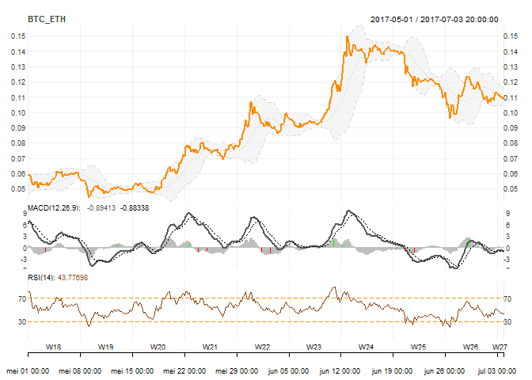

PoloniexR
================

This package aims to provide a user-friendly R wrapper on top of the Poloniex (Cryptocurrency Trading) REST API. Results are converted into R datastructures and are returned to the users in a more intuitive manner.

Installation:

``` r
# install.packages("devtools"")
devtools::install_github("VermeirJellen/PoloniexR")
```

PoloniexPublicAPI / PoloniexTradingAPI
--------------------------------------

A `PoloniexPublicAPI` object can be created as follows:

`poloniex.public <- PoloniexPublicAPI()`

Methods Provided:

-   `ReturnTicker`
-   `Return24hVolume`
-   `ReturnOrderBook`
-   `ReturnTradeHistory`
-   `ReturnChartData`
-   `ReturnCurrencies`
-   `ReturnLoanOrders`

A `PoloniexTradingAPI` object can be created as follows:

`poloniex.trading <- PoloniexTradingAPI(key, secret)`

Methods Provided:

-   **ProcessTradingRequest()**: Allows the users to call any of the trading API methods that are provided by Poloniex.
-   `ReturnBalances`
-   `ReturnCompleteBalances`

Todo: Higher level methods can potentially be wrapped on top of the `ProcessTradingRequest` method (as was done for the `ReturnBalances` and `ReturnCompleteBalances` functions).

**!! EXAMPLES BELOW !!**

### PUBLIC API - EXAMPLES

#### ReturnTicker

Run `?ReturnTicker` for additional function documentation.

``` r
library(PoloniexR)
poloniex.public <- PoloniexPublicAPI()
ticker.info     <- ReturnTicker(poloniex.public)
head(ticker.info)
```

    ##          id       last  lowestAsk highestBid percentChange    baseVolume
    ## BTC_BCN   7 0.00000086 0.00000087 0.00000086   -0.03370786  279.15036906
    ## BTC_BELA  8 0.00009672 0.00009672 0.00009603    0.00750000  134.13850732
    ## BTC_BLK  10 0.00015591 0.00015591 0.00015408    0.02781989   84.81928333
    ## BTC_BTCD 12 0.02764481 0.02787094 0.02764482    0.01423460  210.79891075
    ## BTC_BTM  13 0.00034649 0.00034967 0.00034809    0.04946086   36.49104335
    ## BTC_BTS  14 0.00009740 0.00009787 0.00009755    0.12862108 4102.54720222
    ##                 quoteVolume isFrozen   high24hr    low24hr
    ## BTC_BCN  323974769.68346155        0 0.00000090 0.00000083
    ## BTC_BELA   1373191.51363180        0 0.00010500 0.00009428
    ## BTC_BLK     557697.69356077        0 0.00015900 0.00014408
    ## BTC_BTCD      7428.41002995        0 0.03189990 0.02589803
    ## BTC_BTM     106428.56086309        0 0.00037622 0.00031007
    ## BTC_BTS   46023041.03919320        0 0.00009995 0.00008111

#### Return24hVolume

Run `?Return24hVolume` for additional function documentation.

``` r
poloniex.public <- PoloniexPublicAPI()
volume.info <- Return24hVolume(poloniex.public)
head(volume.info$volume.pairs)
```

    ##               pair1        pair2
    ## BTC_BCN   279.15037 323974769.68
    ## BTC_BELA  134.13851   1373191.51
    ## BTC_BLK    84.81928    557697.69
    ## BTC_BTCD  210.79891      7428.41
    ## BTC_BTM    36.49104    106428.56
    ## BTC_BTS  4102.54720  46023041.04

``` r
volume.info$volume.totals
```

    ##                   BTC            ETH              USDT            XMR
    ## volume 80187.59305213 11726.66214954 68712843.46032991 45906.35491180
    ##              XUSD
    ## volume 0.00000000

#### ReturnOrderBook

Run `?ReturnOrderBook` for additional function documentation.

``` r
pair       <- "BTC_NXT"
depth      <- 10
order.book <- ReturnOrderBook(poloniex.public,
                              pair  = pair,
                              depth = depth)
head(order.book$bid)
```

    ##          bid         amount
    ## 1 0.00005495  3805.09846972
    ## 2 0.00005492            555
    ## 3 0.00005490  7207.16038598
    ## 4 0.00005489   171.33072836
    ## 5 0.00005465  10788.5231473
    ## 6 0.00005463 19946.74953615

``` r
head(order.book$ask)
```

    ##          ask         amount
    ## 1 0.00005500   831.73669609
    ## 2 0.00005501           4600
    ## 3 0.00005502   328.36612593
    ## 4 0.00005515 11692.12446578
    ## 5 0.00005520           2222
    ## 6 0.00005524  2803.54600556

``` r
order.book$frozen
```

    ## [1] FALSE

``` r
order.book$seq
```

    ## [1] 36672018

``` r
pair       <- "all"
depth      <- 10
order.book <- ReturnOrderBook(poloniex.public,
                              pair  = pair,
                              depth = depth)

order.book$BTC_ETH$bid
```

    ##           bid     amount
    ## 1  0.10880928        2.4
    ## 2  0.10878970        2.2
    ## 3  0.10878969 2.48153402
    ## 4  0.10878968 0.15170531
    ## 5  0.10878578       2.26
    ## 6  0.10876412       2.14
    ## 7  0.10874243       2.43
    ## 8  0.10871051          2
    ## 9  0.10869321      37.73
    ## 10 0.10869320        2.3

``` r
order.book$BTC_ETH$ask
```

    ##           ask      amount
    ## 1  0.10895461      29.411
    ## 2  0.10895462  4.75818333
    ## 3  0.10897356  0.50140664
    ## 4  0.10899610           2
    ## 5  0.10900000 10.08075001
    ## 6  0.10901933        2.22
    ## 7  0.10904204 66.29395614
    ## 8  0.10904205 12.60942638
    ## 9  0.10904207      14.071
    ## 10 0.10904208  1.01958855

``` r
order.book$BTC_ETH$frozen
```

    ## [1] FALSE

``` r
order.book$BTC_ETH$seq
```

    ## [1] 367042006

#### ReturnTradeHistory

Run `?ReturnTradeHistory` for additional function documentation.

``` r
Sys.setenv(tz="UTC")
pair   <- "BTC_ETH"
from   <- as.POSIXct("2017-07-01 00:00:00 UTC")
to     <- as.POSIXct("2017-07-04 00:00:00 UTC")

trades.data <- ReturnTradeHistory(theObject = poloniex.public,
                                  pair      = pair,
                                  from      = from,
                                  to        = to)

tail(trades.data)
```

    ##                     globalTradeID tradeID    type   rate        
    ## 2017-07-03 22:19:01 "183422864"   "29387079" "sell" "0.10885259"
    ## 2017-07-03 22:19:03 "183422877"   "29387081" "sell" "0.10885170"
    ## 2017-07-03 22:19:04 "183422883"   "29387082" "buy"  "0.10885170"
    ## 2017-07-03 22:19:07 "183422909"   "29387084" "buy"  "0.10885170"
    ## 2017-07-03 22:19:07 "183422902"   "29387083" "buy"  "0.10885170"
    ## 2017-07-03 22:19:09 "183422911"   "29387085" "buy"  "0.10895461"
    ##                     amount       total       
    ## 2017-07-03 22:19:01 "2.29000000" "0.24927243"
    ## 2017-07-03 22:19:03 "0.00141460" "0.00015398"
    ## 2017-07-03 22:19:04 "0.41276233" "0.04492988"
    ## 2017-07-03 22:19:07 "0.00101055" "0.00011000"
    ## 2017-07-03 22:19:07 "0.41255098" "0.04490687"
    ## 2017-07-03 22:19:09 "7.40000000" "0.80626411"

#### ReturnChartData

Run `?ReturnChartData` for additional function documentation.

``` r
Sys.setenv(tz="UTC")
pair    <- "BTC_ETH"
from    <- as.POSIXct("2015-01-01 00:00:00 UTC")
to      <- as.POSIXct("2018-04-09 00:00:00 UTC")
period  <- "4H"

chart.data <- ReturnChartData(theObject = poloniex.public,
                              pair      = pair,
                              from      = from,
                              to        = to,
                              period    = period)

tail(chart.data)
```

    ##                          high       low      open     close   volume
    ## 2017-07-03 00:00:00 0.1136500 0.1104874 0.1132142 0.1124721 3662.810
    ## 2017-07-03 04:00:00 0.1136137 0.1109000 0.1124000 0.1110523 3200.446
    ## 2017-07-03 08:00:00 0.1116093 0.1093060 0.1110523 0.1105055 3384.972
    ## 2017-07-03 12:00:00 0.1109133 0.1084172 0.1103528 0.1096624 4574.637
    ## 2017-07-03 16:00:00 0.1111645 0.1089170 0.1096624 0.1096080 2072.209
    ## 2017-07-03 20:00:00 0.1098653 0.1086850 0.1096080 0.1088517 1115.494
    ##                     quotevolume weightedaverage
    ## 2017-07-03 00:00:00    32731.72       0.1119040
    ## 2017-07-03 04:00:00    28541.40       0.1121335
    ## 2017-07-03 08:00:00    30568.90       0.1107325
    ## 2017-07-03 12:00:00    41744.30       0.1095871
    ## 2017-07-03 16:00:00    18807.94       0.1101774
    ## 2017-07-03 20:00:00    10216.76       0.1091827

``` r
# install.packages("quantmod")
library(quantmod)
chart.plot <- chart_Series(chart.data[, "close"],
                           type   = "line",
                           name   = "BTC_ETH",
                           subset = "201705/201708")
chart.plot <- add_MACD()
chart.plot <- add_BBands()
chart.plot <- add_RSI()
chart.plot
```



#### ReturnCurrencies

Run `?ReturnCurrencies` for function additional function documentation.

``` r
currencies <- ReturnCurrencies(poloniex.public)
head(currencies)
```

    ##      id           name      txFee minConf disabled delisted frozen
    ## 1CR   1        1CRedit 0.01000000       3        0        1      0
    ## ABY   2        ArtByte 0.01000000       8        0        1      0
    ## AC    3       AsiaCoin 0.01000000      15        0        1      0
    ## ACH   4 Altcoin Herald 0.00000000       5        0        1      0
    ## ADN   5          Aiden 0.01000000      24        0        1      0
    ## AEON  6      AEON Coin 0.01000000      10        0        1      0

#### ReturnLoanOrders

Run `?ReturnLoanOrders` for additional function documentation.

``` r
currency        <- "BTC"
loan.orders     <- ReturnLoanOrders(poloniex.public,
                                    currency = currency)
head(loan.orders$offers)
```

    ##         rate     amount min.days max.days
    ## 1 0.00080300 0.11368218        2        2
    ## 2 0.00084400 0.06038120        2        2
    ## 3 0.00084500 0.07921452        2        2
    ## 4 0.00085000 0.01910767        2        2
    ## 5 0.00087800 1.92062986        2        2
    ## 6 0.00087947 0.01261205        2        2

``` r
head(loan.orders$demands)
```

    ##         rate     amount min.days max.days
    ## 1 0.02000000 0.01816934        2        2
    ## 2 0.00100000 0.00320273        2        2
    ## 3 0.00060000 0.40519916        2        2
    ## 4 0.00004000 0.11441205        2        2

#### GET / SET public API URL and command Strings.

Note: Changing these settings is only useful if Poloniex makes changes to the base URL and/or command strings in the future. If nothing changes, object construction can remain default.

``` r
library(PoloniexR)

poloniex.public <- PoloniexPublicAPI() # Default constructor
GetPoloniexPublicURL(poloniex.public)
```

    ## [1] "https://poloniex.com/public?"

``` r
poloniex.public <- PoloniexPublicAPI(base.url                     = "https://not_working/public?")
poloniex.public <- SetPoloniexPublicURL(poloniex.public, base.url = "https://poloniex.com/public?")
GetPoloniexPublicURL(poloniex.public)
```

    ## [1] "https://poloniex.com/public?"

``` r
GetPoloniexPublicCommands(poloniex.public)
```

    ## $returnTicker
    ## [1] "returnTicker"
    ## 
    ## $return24hVolume
    ## [1] "return24hVolume"
    ## 
    ## $returnOrderBook
    ## [1] "returnOrderBook"
    ## 
    ## $returnTradeHistory
    ## [1] "returnTradeHistory"
    ## 
    ## $returnChartData
    ## [1] "returnChartData"
    ## 
    ## $returnCurrencies
    ## [1] "returnCurrencies"
    ## 
    ## $returnLoanOrders
    ## [1] "returnLoanOrders"

``` r
commands.new <- list(returnTicker    = "returnTicker.new",
                     return24hVolume = "return24hVolume.new")

# missing commands are kept default
poloniex.public <- SetPoloniexPublicCommands(poloniex.public,
                                             commands = commands.new)
```

    ## Warning in SetPoloniexPublicCommands(poloniex.public, commands =
    ## commands.new): Not all commands were set in the API command list input
    ## arguments: Setting missing commands to their respective default values.

``` r
GetPoloniexPublicCommands(poloniex.public)
```

    ## $returnTicker
    ## [1] "returnTicker.new"
    ## 
    ## $return24hVolume
    ## [1] "return24hVolume.new"
    ## 
    ## $returnOrderBook
    ## [1] "returnOrderBook"
    ## 
    ## $returnTradeHistory
    ## [1] "returnTradeHistory"
    ## 
    ## $returnChartData
    ## [1] "returnChartData"
    ## 
    ## $returnCurrencies
    ## [1] "returnCurrencies"
    ## 
    ## $returnLoanOrders
    ## [1] "returnLoanOrders"

### TRADING API - EXAMPLES

Trading should be enabled in your Poloniex settings and you should have access to your account key / secret in order to construct the `PoloniexTradingAPI` object. Internally, all calls to the trading API are sent via HTTP POST. The POST data itself is signed with your key's secret according to the HMAC-SHA512 method.

#### ReturnBalances

Wrapper on top of `ProcessTradingRequest` to fetch account balance info. Run `?ReturnBalances` for additional info.

``` r
key    = your.key
secret = your.secret
poloniex.trading <- PoloniexTradingAPI(key    = key,
                                       secret = secret)
balances <- ReturnBalances(poloniex.trading)
head(balances)
```

#### ReturnCompleteBalances

Wrapper on top of `ProcessTradingRequests` to fetch complete (margin, lending, ..) account balance info. Run `?ReturnCompleteBalances` for additional info.

``` r
balances <- ReturnCompleteBalances(poloniex.trading)
head(balances)

balances <- ReturnCompleteBalances(poloniex.trading, all.balances=TRUE)
head(balances)
```

#### ProcessTradingRequest

This function allows the users to call any of the trading functions that are accessible through the Poloniex Trading API. The `ProcessTradingRequest` method takes a command string as input argument in combination with a list of additional input arguments that correspond to the particular command in question. Largely untested, but should work just fine.. (todo: test!).

Some examples:

``` r
##########################
# returnDepositAddresses #
##########################
?ProcessTradingRequest
deposit.addresses <- ProcessTradingRequest(poloniex.trading,
                                           command = poloniex.trading@commands$returnDepositAddresses)

#########################
# generateNewAddress ####
#########################
new.address <- ProcessTradingRequest(poloniex.trading,
                                     command = poloniex.trading@commands$generateNewAddress,
                                     args    = list(currency = "BTC"))


##############################
# returnDepositsWithdrawals ##
##############################
account.activity <- ProcessTradingRequest(poloniex.trading,
                                          command = poloniex.trading@commands$returnDepositWithdrawals,
                                          args = list(start = as.numeric(as.POSIXct("2017-01-01 00:00:00 UTC"))),
                                                      end   = as.numeric(as.POSIXct("2018-01-01 00:00:00 UTC")))

##############################
### returnOpenOrders #########
##############################
open.orders <- ProcessTradingRequest(poloniex.trading,
                                     command = poloniex.trading@commands$returnOpenOrders,
                                     args    = list(currencyPair = "BTC_ETH"))

open.orders.all <- ProcessTradingRequest(poloniex.trading,
                                         command = poloniex.trading@commands$returnOpenOrders,
                                         args    = list(currencyPair = "all"))


##############################
### Return Trade History #####
##############################
trade.history <-  ProcessTradingRequest(poloniex.trading,
                                        command = poloniex.trading@commands$returnTradeHistory,
                                        args = list(currencyPair = "BTC_ETH",
                                                    start        = as.numeric(as.POSIXct("2017-01-01 00:00:00 UTC"))),
                                                    end          = as.numeric(as.POSIXct("2018-01-01 00:00:00 UTC")))

# no range specified: limit to one day
trade.history.all <-  ProcessTradingRequest(poloniex.trading,
                                            command = poloniex.trading@commands$returnTradeHistory,
                                            args    = list(currencyPair = "all"))


##############################
### ReturnOrderTrades ########
##############################
order.trades <- ProcessTradingRequest(poloniex.trading,
                                      command = poloniex.trading@commands$returnOrderTrades,
                                      args    = list(orderNumber = 1))

##############################
######### Buy ################
##############################
buy.order <- ProcessTradingRequest(poloniex.trading,
                                   command = poloniex.trading@commands$buy,
                                   args    = list(currencyPair      = "BTC_ETH",
                                                  rate              = 0.01,
                                                  amount            = 1,
                                                  immediateOrCancel = 1)) # fillOrKill, postOnly

##############################
######### Sell ###############
##############################
sell.order <- ProcessTradingRequest(poloniex.trading,
                                    command = poloniex.trading@commands$sell,
                                    args    = list(currencyPair      = "BTC_ETH",
                                                   rate              = 0.01,
                                                   amount            = 1))


##############################
######### cancelOrder ########
##############################
cancel.order <- ProcessTradingRequest(poloniex.trading,
                                      command = poloniex.trading@commands$cancelOrder,
                                      args    = list(orderNumber = 1))

##############################
######### moveOrder ##########
##############################
move.order <- ProcessTradingRequest(poloniex.trading,
                                    command = poloniex.trading@commands$moveOrder,
                                    args    = list(orderNumber       = 1,
                                                   rate              = 0.1,
                                                   amount            = 1,
                                                   immediateOrCancel = 1)) # postOnly
```

Other Trade functionality (View Poloniex API documentation):

-   withdraw: `poloniex.trading@commands$withdraw`
-   returnFeeInfo: `poloniex.trading@commands$returnFeeInfo`
-   returnAvailableAccountBalances: `poloniex.trading@commands$returnAvailableAccountBalances`
-   returnTradeableBalances: `poloniex.trading@commands$returnTradeableBalances`
-   transferBalance: `poloniex.trading@commands$transferBalance`
-   returnMarginAccountSummary: `poloniex.trading@commands$returnMarginAccountSummary`
-   marginBuy: `poloniex.trading@commands$marginBuy`
-   marginSell: `poloniex.trading@commands$marginSell`
-   getmarginPosition: `poloniex.trading@getMarginPosition`
-   closeMarginPosition: `poloniex.trading@closeMarginPosition`
-   createLoanOffer: `poloniex.trading@commands$createLoanOffer`
-   cancelLoanOffer: `poloniex.trading@commands$cancelLoanOffer`
-   returnOpenLoanOffers: `poloniex.trading@commands$returnOpenLoanOffers`
-   returnActiveLoans: `poloniex.trading@commands$returnActiveLoans`
-   returnLendingHistory: `poloniex.trading@commands$returnLendingHistory`
-   toggleAutoRenew: `poloniex.trading@commands$toggleAutoRenew`

#### GETTERS / SETTERS

Same remark as before: Modification of the object fields are only required if and when Poloniex modifies the trading API base URL and/or the command strings. Default constructor can be used for now.

``` r
###########################################################
#################### GETTERs / SETTERS ####################
###########################################################

##################
# Get Trading URL#
##################
GetPoloniexTradingURL(poloniex.trading)

##################
# Set Trading URL#
##################
?SetPoloniexTradingURL
poloniex.trading <- PoloniexTradingAPI(trading.base.url = "https://not_working/tradingApi?",
                                       key              = your.key,
                                       secret           = your.secret)

poloniex.trading <- SetPoloniexTradingURL(poloniex.trading,
                                          trading.base.url = "https://poloniex.com/tradingApi?")
GetPoloniexTradingURL(poloniex.trading)

#######################
# Get Trading commands#
#######################
?GetPoloniexTradingCommands
GetPoloniexTradingCommands(poloniex.trading)

#######################
# Set Trading Commands#
#######################
?SetPoloniexTradingCommands
commands.new <- list(returnTradeHistory = "returnTradeHistory.new",
                     withdraw = "withdraw.new")
poloniex.trading <- SetPoloniexTradingCommands(poloniex.trading,
                                               commands = commands.new)

GetPoloniexTradingCommands(poloniex.trading)
commands.new <- list(returnTicker    = "returnTicker.new",
                     return24hVolume = "return24hVolume.new")
poloniex.trading <- SetPoloniexTradingCommands(poloniex.trading,
                                               commands = commands.new)
GetPoloniexPublicCommands(poloniex.public)
```

Donations
---------

If you find this software useful and/or you would like to see additional extensions or a future CRAN release, feel free to donate some crypto:

Crypto Addresses:

-   BTC: 1QHtZLZ15Cmj4FPr5h5exDjYciBDhh7mzA
-   LTC: LhKf6MQ7LY1k8YMaAq9z3APz8kVyFX3L2M
-   ETH: 0x8E44D7C96896f2e0Cd5a6CC1A2e6a3716B85B479
-   DASH: Xvicgp3ga3sczHtLqt3ekt7fQ62G9KaKNB

Or preferably, donate some of my favorite coins :)

-   GAME: GMxcsDAaHCBkLnN42Fs9Dy1fpDiLNxSKX1
-   WAVES: 3PQ8KFdw2nWxQATsXQj8NJvSa1VhBcKePaf
-   SIA: 11f91dd7fb894489916f36fa2ceda2fdcd4f1894b29364a7e82e9e5d44a8209dbd04a8120d47

Licensing
---------

Copyright 2017 Essential Data Science Consulting ltd. ([EssentialQuant.com](http://essentialquant.com "EssentialQuant") / <jellenvermeir@essentialquant.com>). This software is copyrighted under the MIT license: View added [LICENSE](./LICENSE) file.
